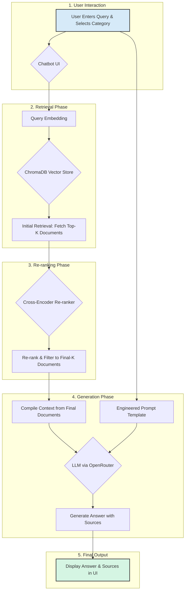

# RAG-Powered RAKwireless Support Chatbot


This project implements a sophisticated, retrieval-augmented generation (RAG) chatbot designed to answer questions about RAKwireless products. It uses a local knowledge base built from Markdown documentation, ensuring that answers are grounded in factual data and cited for user trust.

The system features a robust, automated evaluation pipeline that allows you to test and select the most effective retrieval models and parameters before deployment. The user-facing chatbot is built with Streamlit and can connect to a variety of large language models (LLMs) via the OpenRouter API.


*(Note: Replace with an actual screenshot of your chatbot UI)*

---

## Key Features

- **Retrieval-Augmented Generation (RAG)**: Provides accurate, context-aware answers based on a local knowledge base, minimizing hallucinations.
- **Automated Evaluation Pipeline**: Systematically tests and measures the performance of different retrieval configurations (embedding models, re-rankers, K-values) to find the optimal setup.
- **Source-Cited Responses**: Every answer is accompanied by links to the source documents, providing transparency and trust.
- **Category-Specific & Global Search**: Users can scope their search to a specific product category or search across the entire knowledge base.
- **Flexible LLM Integration**: Connects to various state-of-the-art LLMs (e.g., DeepSeek, GPT-4, Llama 3) through a custom OpenRouter wrapper.
- **Developer-Friendly**: Built with modern, widely-used libraries like LangChain, Streamlit, and ChromaDB.
- **UI Debug Mode**: The interface includes an optional debug mode to inspect the exact documents being sent to the LLM as context, which is invaluable for troubleshooting and refinement.

---

## How It Works: The RAG Pipeline

The chatbot operates using a multi-step Retrieval-Augmented Generation (RAG) pipeline to ensure high-quality, factual answers.


1.  **User Query & Scoping**: The user enters a query and selects a product category, which determines which database to search.
2.  **Initial Retrieval**: The query is converted into a vector embedding. A similarity search in the selected ChromaDB store retrieves an initial set of relevant document chunks (`initial_k`).
3.  **Re-ranking**: A more powerful cross-encoder model re-evaluates and re-sorts the initial documents, selecting only the most relevant ones (`final_k`).
4.  **Context Augmentation & Prompting**: The refined documents are compiled into a context block and inserted into a prompt template along with the original query.
5.  **LLM Generation**: The complete prompt is sent to the LLM, which generates a final answer based *only* on the provided information, citing the sources.

---

## Setup and Installation Guide

Follow these steps to get the chatbot running on your local machine.

### Step 1: Prerequisites

Ensure you have the following installed:
- [Python 3.9+](https://www.python.org/downloads/)
- [Git](https://git-scm.com/downloads/)

### Step 2: Clone the Repository and Set Up the Environment

First, clone this repository and navigate into the project directory.

```bash
git clone https://github.com/ShivamTripathi028/rak-support-bot
cd rak-support-bot
```

Next, create a Python virtual environment and install the required dependencies from `requirements.txt`.

```bash
# Create a virtual environment
python -m venv venv

# Activate the virtual environment
# On Windows:
venv\Scripts\activate
# On macOS/Linux:
source venv/bin/activate

# Install the required packages
pip install -r requirements.txt
```

### Step 3: Set Up Your OpenRouter API Key

This chatbot requires an API key from [OpenRouter](https://openrouter.ai/) to connect to a Large Language Model.

1.  Sign up for a free account on OpenRouter and obtain your API key.
2.  Set the API key as an environment variable. The most convenient way is to create a `.env` file in the root of the project directory:

    **Create a file named `.env`:**
    ```
    OPENROUTER_API_KEY="your_openrouter_api_key_here"
    ```
    The application will automatically load this variable on startup.

### Step 4: Prepare the Knowledge Base Data

The chatbot learns from a local directory of Markdown files.

1.  In the project root, create a directory named `rak-products`.
2.  Organize your product documentation inside this directory. Each sub-folder is treated as a distinct product category.

    ```
    rak-products/
    ├── WisBlock/
    │   ├── README.md
    │   └── RAK1901/
    │       └── README.md
    ├── WisGate/
    │   ├── README.md
    │   └── RAK7249/
    │       └── README.md
    └── Accessories/
        └── README.md
    ```

### Step 5: Build the Vector Databases

Run the `build_databases.py` script. This will process your documentation, generate vector embeddings, and create the searchable ChromaDB databases in a new `new_rak_category_dbs/` directory.

```bash
python build_databases.py
```
This process may take some time, especially on the first run, as it needs to download the embedding model.

### Step 6: (Recommended) Run Automated Evaluation

To guarantee the best performance, run the automated evaluation script. It will test different retrieval strategies against the `evaluation_dataset.json` and find the optimal settings for your specific data.

```bash
python evaluate_rag_retrieval_automated.py
```
The script saves detailed results to `automated_evaluation_results.csv` and prints a summary recommending the best parameters. You can also view this summary anytime by running `python display_results_table.py`.

### Step 7: Update the Configuration

Open the `config.py` file and update the RAG pipeline parameters with the values recommended by the evaluation script.

**`config.py`**
```python
# --- RAG Pipeline Parameters ---
# Update these values based on the output from the evaluation script
BEST_INITIAL_K = 20  # e.g., The best 'initial_k' from the results
BEST_FINAL_K = 7     # e.g., The best 'final_k' from the results
BEST_RERANKER_MODEL = "BAAI/bge-reranker-large" # e.g., The best 'reranker_model'
```

### Step 8: Launch the Chatbot

You are now ready to run the chatbot! Use the `streamlit` command to launch the application:

```bash
streamlit run rak_chatbot.py
```

Your default web browser should automatically open with the chatbot's user interface. You can now start asking questions!

---

## Using the Chatbot

- **Search Scope**: Use the sidebar to select the product category you want to ask questions about. Choose "All Categories (Global DB)" for a broader search.
- **Debug Mode**: Check the "Enable Debug Outputs" box in the sidebar. After an answer is generated, an expander will appear below it, showing the exact document chunks that were used as context for the LLM. This is extremely useful for understanding the chatbot's reasoning.

---

## File Descriptions

| File | Purpose |
| :--- | :--- |
| **`rak_chatbot.py`** | Main application file. Runs the Streamlit UI, manages session state, and orchestrates the RAG chain. |
| **`build_databases.py`** | Creates the knowledge base. Reads Markdown files, splits them, generates embeddings, and saves them to ChromaDB. |
| **`evaluate_rag_retrieval_automated.py`** | Tests the RAG pipeline's effectiveness by iterating through different retrieval parameters and scoring them. |
| **`config.py`** | Central configuration hub. Defines file paths, model names, and the optimal RAG pipeline parameters. |
| **`custom_llm.py`** | Defines a custom LangChain wrapper (`OpenRouterChatModel`) to connect to the OpenRouter API. |
| **`utils.py`** | Contains helper functions for scanning product categories and loading/parsing Markdown files with metadata. |
| **`evaluation_dataset.json`** | The "answer key" for the evaluation script. Contains questions, expected source paths, and categories. |
| **`automated_evaluation_results.csv`** | CSV output from the evaluation script, logging the performance of each parameter set. |
| **`display_results_table.py`** | Utility script to read the results CSV and print a formatted summary table to the console. |
| **`automated_evaluation_log.txt`** | Detailed log file from the evaluation script, useful for debugging the evaluation process. |
| **`requirements.in` / `requirements.txt`** | Define the project's Python dependencies for a reproducible environment. |
| **`.gitignore`** | Tells Git to ignore generated files and data directories (e.g., databases, product data). |

---

## Contributing

Contributions are welcome! If you have suggestions for improvements or find any issues, please feel free to open an issue or submit a pull request.

1.  Fork the repository.
2.  Create a new branch (`git checkout -b feature/YourFeature`).
3.  Commit your changes (`git commit -m 'Add some feature'`).
4.  Push to the branch (`git push origin feature/YourFeature`).
5.  Open a Pull Request.

---

## License

This project is licensed under the MIT License - see the [LICENSE](LICENSE) file for details.
